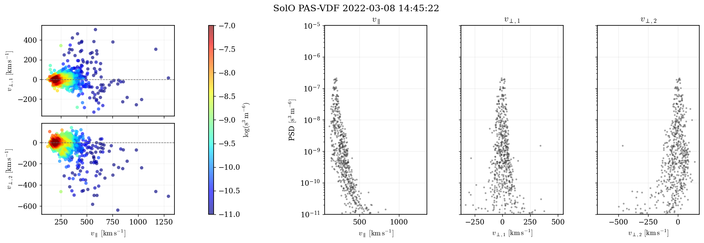
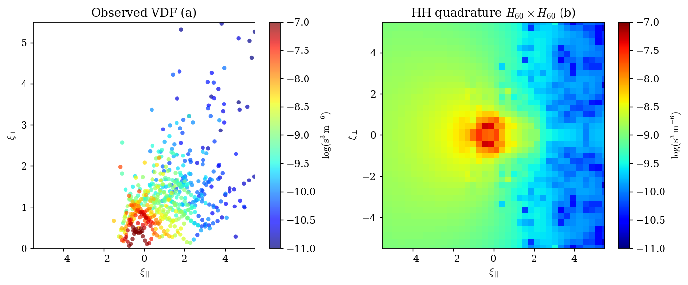
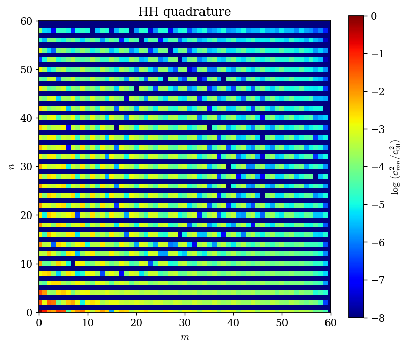
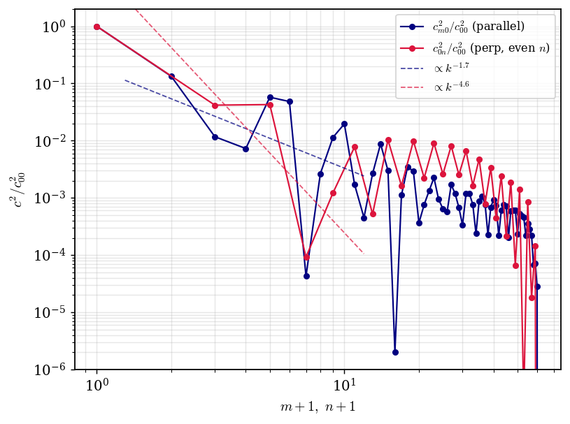
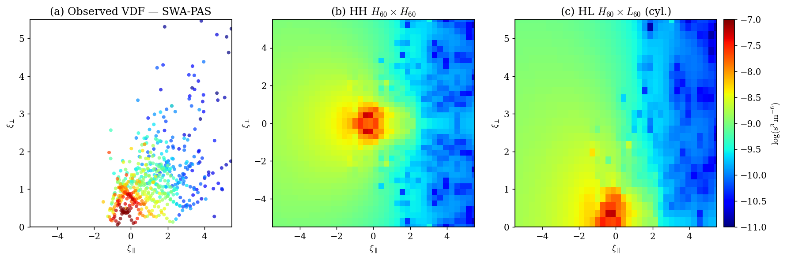
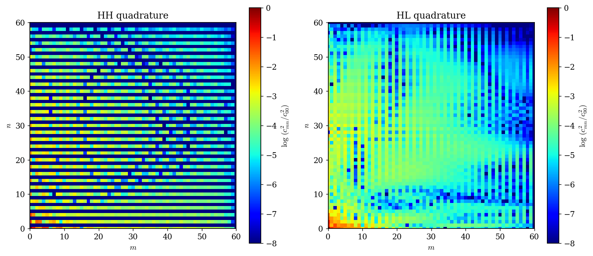

<div align="center">

# 🛰️ Función de Distribución de Velocidad — Solar Orbiter / SWA-PAS

### Reproducción de la VDF de protones, nodos de Hermite y espectro 2D
#### Evento: **2022-03-08 · 14:45:22 UTC**

<br>


-0b3d91?style=flat-square)


</div>

---

## 📖 Descripción

Este repositorio **reproduce el análisis de la Función de Distribución de Velocidad (VDF)**
de protones del viento solar medida por el instrumento **SWA-PAS** (*Solar Wind Analyser –
Proton Alpha Sensor*) a bordo de **Solar Orbiter**, siguiendo la nota de cátedra
*«Space science and data analysis: 4. Velocity distribution function»* de
**Dr. Byeongseon Park** (Instituto de Geofísica, UNAM).

A partir del producto oficial **L2 `swa-pas-vdf`** y del campo magnético **L2 `mag-rtn-normal`**
(descargados del [Solar Orbiter Archive, SOAR](https://soar.esac.esa.int/soar/)) el proyecto:

| # | Tarea | Figura objetivo | Resultado |
|---|-------|-----------------|-----------|
| **1** | Diagrama de dispersión de la VDF en marco alineado al campo | *slide 3* (sin panel de energía) | [`task1_vdf_scatter.png`](figures/task1_vdf_scatter.png) |
| **2** | Nodos de **Hermite** e interpolación de la VDF sobre la malla | *slide 23, panel b* (HH `H₆₀×H₆₀`) | [`task2_hermite_grid.png`](figures/task2_hermite_grid.png) |
| **3** | **Espectro 2D** `log(c_mn²/c₀₀²)` | *slide 25, panel izquierdo* (HH) | [`task3_hh_spectrum.png`](figures/task3_hh_spectrum.png) |
| ⭐ | *Bonus*: descomposición **Hermite-Laguerre** (HL) | *slides 23c y 25 der.* | [`bonus_*`](figures/) |

> 📚 La teoría completa (instrumento, reconstrucción, momentos, modelos paramétricos,
> descomposición polinomial, cuadratura gaussiana y cascada anisotrópica) está en
> **[`docs/THEORY.md`](docs/THEORY.md)**.

---

## 🎯 Tarea 1 — Dispersión de la VDF (marco alineado al campo)

Reconstrucción de cada bin `(energía, elevación, azimut)` a un vector de velocidad en RTN,
proyección al marco alineado al campo magnético `(v∥, v⊥₁, v⊥₂)` y coloreado por la densidad
del espacio de fases `log₁₀(PSD)`. Se omite el panel de energía, como se pidió.



*El núcleo (rojo) se sitúa en `v∥ ≈ 250 km/s`, `v⊥ ≈ 0`; la cola supratérmica (azul) se extiende
a altas velocidades. Los tres paneles derechos muestran la PSD frente a cada componente.*

---

## 🎯 Tarea 2 — Nodos de Hermite e interpolación (cuadratura HH)

Se construyen los **60 nodos de Gauss-Hermite** (raíces de `H₆₀`, vía el algoritmo de
**Golub-Welsch**) en `ξ∥` y `ξ⊥`, se refleja el perpendicular `f(ξ⊥)=f(−ξ⊥)` (estilo Larosa)
y se **interpola la VDF observada** sobre la malla mediante peso inverso a la distancia (IDW).



*Panel (a): VDF observada en coordenadas normalizadas `ξ=(v−u)/w`. Panel (b): VDF interpolada
sobre la malla `H₆₀×H₆₀`, con el núcleo girotrópico centrado y reflejado.*

---

## 🎯 Tarea 3 — Espectro 2D de Hermite

Con la VDF en la malla se calculan los coeficientes
`c_mn = Σ f(ξᵢ,ξⱼ) e^{ξᵢ²} w_H(ξᵢ) e^{ξⱼ²} w_H(ξⱼ) ψ_m(ξᵢ) ψ_n(ξⱼ)`
y se grafica `log₁₀(c_mn²/c₀₀²)` sobre `(m,n) ∈ [0,60]`.

<div align="center">


</div>

*Izquierda: el **estriado par/impar en `n`** aparece porque la simetría de espejo anula los
coeficientes impares. Derecha: la pendiente paralela (≈ `k⁻¹·⁷`) es más somera que la
perpendicular (≈ `k⁻⁴·⁶`) → **cascada anisotrópica** (la cascada paralela es más extendida).*

---

## ⭐ Bonus — Hermite-Laguerre (HL) y reproducción completa de los slides 23 y 25

<div align="center">

<br><br>

</div>

*La cuadratura HL usa polinomios de Laguerre en el perpendicular (cilíndrico, `μ=ξ⊥²`, rango
`[0,∞]`, estilo Coburn). Nótese que el espectro HL **no presenta** el estriado par/impar.*

---

## 📊 Resultados físicos (2022-03-08 14:45:22.535)

| Magnitud | Valor | | Magnitud | Valor |
|---|---|---|---|---|
| **B** (RTN) | `[−21.5, −8.1, 16.3]` nT | | **n** (densidad) | `39.3 cm⁻³` |
| **\|B\|** | `28.2` nT | | **\|u\|** (rapidez) | `309.7 km/s` |
| **u** (RTN) | `[304.4, −56.9, 6.2]` km/s | | **u∥** | `212.7 km/s` |
| **T∥** | `2.32 × 10⁵ K` | | **T⊥** | `1.85 × 10⁵ K` |
| **w∥** | `61.9 km/s` | | **w⊥** | `55.3 km/s` |
| **T⊥/T∥** | `0.80` (anisotropía paralela) | | bins con `PSD>0` | `614 / 9504` |

> El flujo de protones está a **~47° de B**, por lo que el arrastre perpendicular es grande;
> por eso, en la Tarea 1, el perpendicular se centra en la deriva (anillo girotrópico en `v⊥=0`).

---

## 🗂️ Estructura del proyecto

```
.
├── README.md                  ← este archivo
├── requirements.txt
├── docs/
│   ├── THEORY.md              ← teoría completa (español)
│   ├── THEORY_reference_en.md ← síntesis de investigación (inglés, con citas)
│   └── research_notes_en.md   ← notas por tema
├── src/
│   ├── config.py             ← constantes, rutas y parámetros
│   ├── download_data.py      ← descarga de SOAR (REST API)
│   ├── cdf_io.py             ← lectura de los CDF (VDF y MAG)
│   ├── physics.py            ← reconstrucción, marco FA y momentos
│   ├── hermite.py            ← cuadratura Gauss-Hermite/Laguerre + IDW
│   ├── plots.py              ← figuras (estilo de la nota)
│   └── run_analysis.py       ← pipeline principal
├── data/
│   ├── raw/                  ← CDF descargados (no versionados)
│   └── processed/            ← VDF procesada + momentos (npz/json)
└── figures/                  ← figuras generadas (PNG)
```

---

## 🚀 Instalación y uso

```bash
# 1) entorno (usa el stack científico del sistema + cdflib)
python3 -m venv --system-site-packages .venv
./.venv/bin/pip install -r requirements.txt

# 2) descargar los datos desde SOAR  (VDF ~820 MB, MAG ~11 MB)
./.venv/bin/python src/download_data.py

# 3) ejecutar todo el análisis y generar las figuras
./.venv/bin/python src/run_analysis.py

# (opcional) validar el núcleo numérico (ortonormalidad de Hermite/Laguerre)
./.venv/bin/python src/hermite.py
```

Las figuras quedan en `figures/` y los productos intermedios en `data/processed/`.

---

## 🛰️ Datos

| Producto | Descriptor SOAR | Variables usadas |
|---|---|---|
| VDF de protones | `solo_L2_swa-pas-vdf_20220308` | `vdf`, `Energy`, `Azimuth`, `Elevation`, `PAS_to_RTN` |
| Campo magnético | `solo_L2_mag-rtn-normal_20220308` | `EPOCH`, `B_RTN` |

Fuente: **[Solar Orbiter Archive (SOAR)](https://soar.esac.esa.int/soar/)**, ESAC/ESA.

---

## 📚 Referencias principales

- **Owen, C. J. et al. (2020)** — *The Solar Orbiter Solar Wind Analyser (SWA) suite*, A&A 642, A16. [doi:10.1051/0004-6361/201937259](https://doi.org/10.1051/0004-6361/201937259)
- **Fedorov, A. (2020)** — *SWA-PAS L2 Data User Guide*, IRAP / SOAR.
- **Servidio, S. et al. (2017)** — *Hermite decomposition of ion VDFs*, PRL 119, 205101.
- **Pezzi, O. et al. (2018)** — *Hermite spectral method in kinetic simulations*.
- **Coburn, J. et al. (2024)** — *Hermite-Laguerre de VDFs de electrones (Solar Orbiter)*.
- **Larosa, A. et al. (2025)** — *Hermite-Hermite de VDFs de iones (Parker Solar Probe)*.
- **Golub, G. H. & Welsch, J. H. (1969)** — *Calculation of Gauss quadrature rules*, Math. Comp. 23.

> Nota de atribución: la documentación de PAS está en Owen et al. (2020) y la Guía de Usuario
> de Fedorov (2020) (Livi et al. 2023 corresponde a SWA-**HIS**). El artículo HH de Larosa et al.
> (2025) usa **Parker Solar Probe** (SPAN-i); el trabajo espectral en **Solar Orbiter** es Coburn
> et al. (2024). Las pendientes específicas de la nota son convenciones del curso.

---

<div align="center">

*Tarea de cátedra · Instituto de Geofísica, UNAM · Reproducción de la VDF de Solar Orbiter*

</div>
